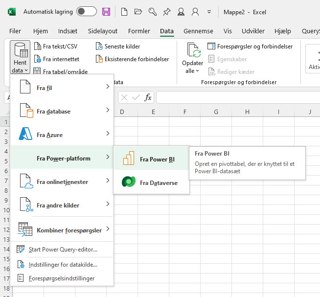
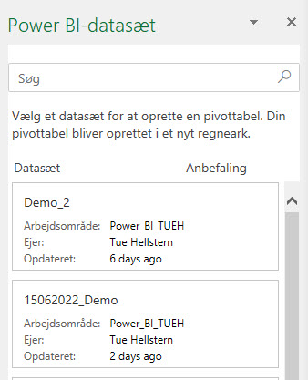
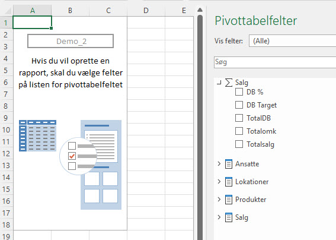
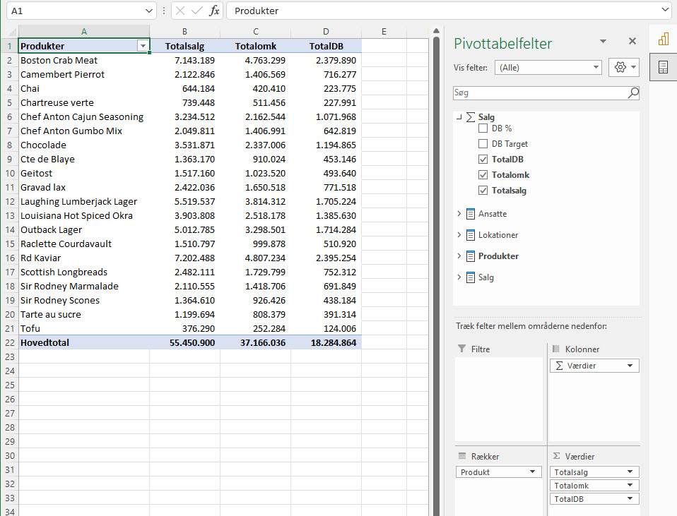

# Brug Power BI data i Excel
Microsoft Power Bi er et super program til at at analysere, vise og dele dine rapport - *Men hvad nu hvis du gerne vil analysere yderlige på data i Excel?*

Ikke noget problem! - Du kan direkte fra Excel hente dine Power BI data modeller.

## Hent data
For at hente dine Power Bi data ind i Excel skal du gøre følgende:

1. Åben **Excel**
2. Vælg **Data** fanen
3. **Hent data** - **Fra Power BI**

4. Vælg det Power BI-datasæt du vil importere

5. Data modellen fra den rapport bliver nu importeret

Nu kan du bruge alle dine data og målinger som du har oprettet i Power BI. De relationer som du har oprettet i Power Bi er også aktive i Excel. Hvilket betyder at du kan kombinere data fra flere tabeller.

## Video

