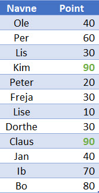

# Brug af FILTER funktionen i Excel
*Du har en liste med personer og nogle point de har fået* - **Din opgave er at finde den eller dem med det højeste antal point**

Dette er din liste som en Excel tabel med navnet *PointTabel*

Det er nemt nok hvis der kun er en der har det højeste antal point, men her er der to!

Til dette kan du bruge FILTRER funktionen, synktaksen er:

**=FILTRER(matrix, inkluder, [hvis_tom])**

Her skal du bruge:

**=FILTRER(PointTabel[Navne];PointTabel[Point]=MAKS(PointTabel[Point]))**

<iframe src="https://www.loom.com/embed/0fb52e64004f44279eebaf32534fd604" frameborder="0" webkitallowfullscreen mozallowfullscreen allowfullscreen style="position: absolute; top: 0; left: 0; width: 100%; height: 100%;"></iframe>

Du kan hente min Excel fil her: [FILTRER.xlsx](./files/FILTRER.xlsx)