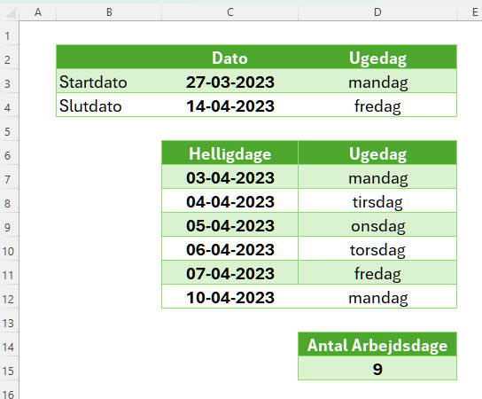

**ANTAL.ARBEJDSDAGE** returnerer antallet af arbejdsdage mellem to datoer, eksklusiv weekender og eventuelle helligdage.

<!--more-->

Her er syntaksen for **ANTAL.ARBEJDSDAGE**

    =ANTAL.ARBEJDSDAGE(startdato; slutdato; [feriedage])

- **startdato**: Den dato du vil starte tællingen fra.
- **slutdato**: Den dato du vil tælle til.
- **[feriedage]**: En valgfri liste over datoer, der skal betragtes som fridage/helligdage og derfor ikke tælles som arbejdsdage.

## Eksempel - Påsken 2023

    =ANTAL.ARBEJDSDAGE(C3;C4;C7:C12)

- **startdato**: 27-03-2023 (*C3*)
- **slutdato**: 14-04-2023 (*C4*)
- **feriedage**: *C7:C12*

**Resultat**: 9

## UK
NETWORKDAYS