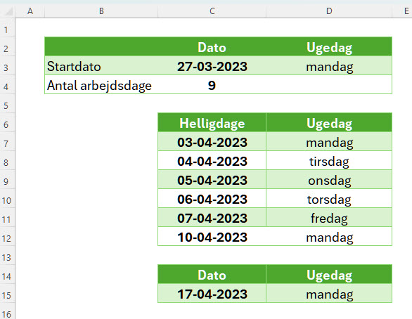

**ARBEJDSDAG** i Excel returnerer en dato, der er et specifikt antal arbejdsdage før eller efter en startdato, under hensyntagen til weekender og eventuelle helligdage.

<!--more-->

Her er syntaksen for **ARBEJDSDAG**

    =ARBEJDSDAG(startdato; dage; [feriedage])

- **startdato**: Den dato du vil starte tællingen fra.
- **dage**: Det antal arbejdsdage du vil lægge til eller trække fra.
- **[feriedage]**: En valgfri liste over datoer, der skal betragtes som fridage/helligdage og derfor ikke tælles som arbejdsdage.

**ARBEJDSDAG** er særligt nyttig hvor du skal beregne deadlines eller leveringsdatoer, der tager hensyn til arbejdsdage. 

## Eksempel - Påsken 2023

    =ARBEJDSDAG(C3;C4;C7:C12)

- **startdato**: 27-03-2023 (*C3*)
- **dage**: 9 (*C4*)
- **feriedage**: *C7:C12*

**Resultat**: 17-04-2023

## UK
WORKDAY